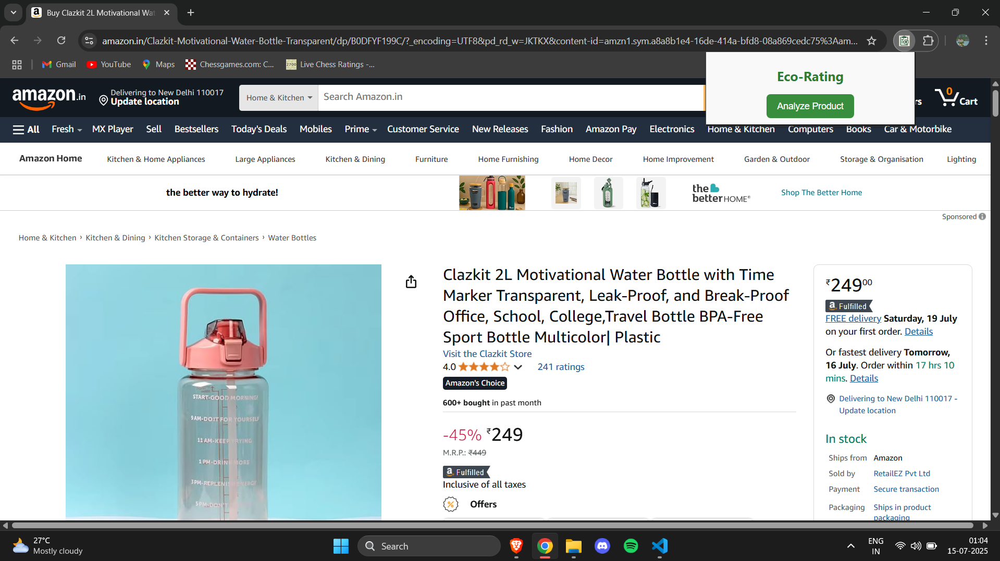
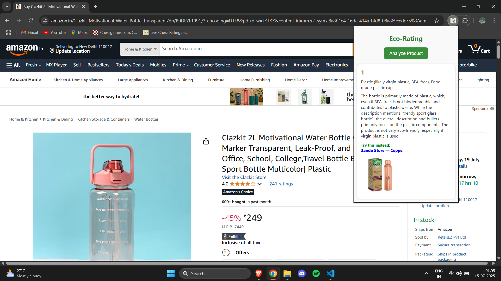

#  Eco-Rating Chrome Extension

A Chrome Extension that analyzes product listings and provides an **Eco-Friendliness Score** based on the materials used in the product. It uses a **LangChain-powered FastAPI backend** to evaluate the sustainability of product components.
>The backend is hosted privately, but the extension is fully functional (buggy though 😅, still working on it...)

Works with (so far):
- Amazon
- Flipkart
- Walmart
> ...more coming soon!
---

## Features

- Extracts product title, description, and bullet points from Amazon/Flipkart.
- Sends the data to a FastAPI server that:
  - Uses LangChain + Gemini Flash
  - Rates the product’s environmental friendliness (1–5)
  - Identifies materials used
  - Returns reasoning behind the rating
- Results shown directly in the popup.
- Shows cleaner products as an alternative if eco-score is low.

---

## Tech Stack

- **Frontend**: Chrome Extension (Manifest V3), JavaScript
- **Backend**: FastAPI + LangChain + Gemini Flash (GoogleGenerativeAI)
- **RAG**: Retrieval-Augmented Generation using Chroma vector store and FAISS

---

## Setup Instructions

### Steps

1. **Download the Extension Folder**
- Visit the [GitHub Repository](https://github.com/pkala7968/Sustainability-ext-pb)
- Click the green **"Code"** button, then select **"Download ZIP"**
- Extract the ZIP file and locate the `extension/` folder
2. **Load the Extension into Chrome**
- Open Chrome and go to chrome://extensions/
- Turn on the Developer Mode toggle (top right)
- Click "Load unpacked"
- In the file picker, select the extracted extension/ folder
> You should now see the Eco-Rating extension icon in your Chrome toolbar.
3. **Use the Extension**
- Go to any supported e-commerce site (e.g., Amazon, Flipkart)
- Open the product page for any item
- Click the Eco-Rating extension icon in your browser
- Click the “Analyze Product” button
- The popup will:
  - Extract product info from the page
  - Call the backend API to compute an eco-score
  - Show the score, materials, reasoning, and a greener alternative (if any)

---

## Check It Out!

---
## ⚠️ Note

This is still under production; will be out for use soon!